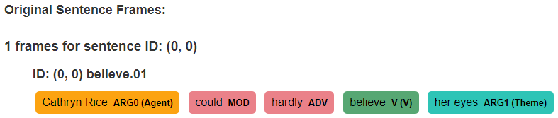
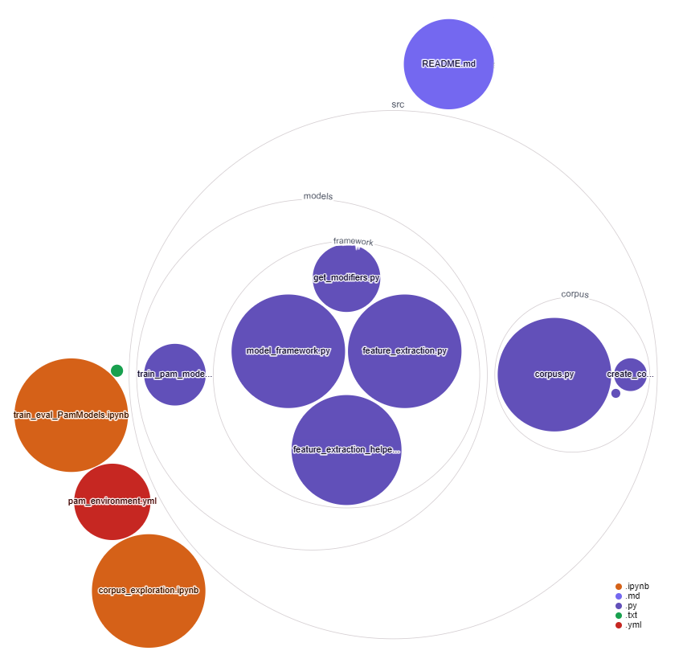

# Predicting Argument Modifiers (PAM)

The models in this project are trained to perform a classification task, namely predicting the modifier role for a phrase. This is a subtask of Semantic Role Labeling (SRL) which provides a semantic role to sentence constituents.

This README provides a general overview of the project. This includes its structure, requirements, corpus creation and model training. Specific code examples can be found in the **corpus_exploration** and **train_eval_PamModels** notebooks.

The data used for this project is gathered from the [OntoNotes 5.0 corpus](https://catalog.ldc.upenn.edu/LDC2013T19) which contains a [PropBank](https://propbank.github.io/) annotation layer. This project was completed during an internship at the VUB AI Lab and the data was aquired as part of this internship. This data is protected by a license and can, therefore, not be distributed freely. Please take this into consideration.

The PropBank annotation layer contains information about the semantic frames and roles present in a sentence. For example, consider the sentence "Cathryn Rice could hardly believe her eyes".



This sentence contains one frame which is evoked by the Verb (V) **believe**. This frame has 5 roles in total:

* **Cathyrn Rice** = ARG0 (Agent)
* **could** = MOD (Modal)
* **hardly** = ADV (Adverbial)
* **believe** = V (Verb)
* **her eyes** = ARG1 (Theme)

In [PropBank annotations](https://github.com/propbank/propbank-documentation/raw/master/annotation-guidelines/Propbank-Annotation-Guidelines.pdf), a distinction is made between *core roles* and *modifier roles*.

Core roles are defined specifically in relation to the frame evoking element. These include V, ARG0, ARG1, ARG2, ARG3, ARG4, ARG5 & ARGA.

Modifier roles are shared across frame evoking elements and are, therefore, not specific to a particular frame evoking element. These include ADV, MOD, DIS, LOC, MNR, NEG, ADJ, PRP, CAU, DIR, PRD, EXT, LVB, PRR, GOL, DSP, COM, CXN & REC. More information about what these roles represent can be found in the [PropBank Annotation Guidelines](https://github.com/propbank/propbank-documentation/raw/master/annotation-guidelines/Propbank-Annotation-Guidelines.pdf).

The task this models are trained for is predicting the argument modifier roles given a string of a phrase. For instance, the sentence "Cathryn Rice could hardly believe her eyes" contains two modifier roles:

* **could** = MOD (Modal)
* **hardly** = ADV (Adverbial)

The model's task is to predict which modifier role the phrase "could" has and which modifier role the phrase "hardly" has. The train data consists of modifier phrases and their roles. The test data consists of modifier phrases alone. This means that the model's task is not to predict the modifier roles given a sentence. This would be part of a larger SRL system.

## Project File Structure



This project contains two main folders, namely a `data` and `src` folder:

### Data

The data folder contains two subfolders, namely `ontonotes_data` and `verbatlas_data`. The verbatlas data was initially incorporated as part of the corpus to extract features but this was eventually not used and will not be discussed further here.

The `ontonotes_data` contains a train, dev (development) and test set. The models trained in this project were all trained on the train set and evaluated on the dev set. The final evaluation is done on the test set.

### Src

The `src` folder contains the code used in this project. It has two subfolder, namely `corpus` and `models`:

* `corpus:` This folder contains the scripts to turn the raw data files into a Corpus object. This is done by running the `create_corpus.py` script. Note that creating a Corpus object has the optional argument of performing a data split. This is useful to create a subcorpus for testing purposes.
* `models:` This folder contains the scripts to train the PAM models. This is done specifically by creating a pipeline to extract features and fit these features to a Logistic Regression model. The pipeline is part of a framework which incorporates a `PamModel` and `FeatureExtractor` object.

## Requirements

The basic requirements for using this project's code can be installed using the requirements.txt file.

`pip install -r requirements.txt`

Alternatively, the conda environment can be created by:

`conda env create -f pam_environment.yml`

Additionally, this project relies on an external, pre-trained model to process the strings and/or extract features:

`python -m spacy download en_core_web_sm`

## Training a PamModel

Training a PamModel involves initiating a FeatureExtraction and a PamModel object:

```python
# Instantiate the FeatureExtractor object. This object is responsible for transforming raw text data into feature vectors 
# that can be used by machine learning models. It does this by applying various feature extraction methods to the text.

feature_extractor = FeatureExtractor(
    feature_methods=[
        # Bag of Words (BOW): This method creates a feature vector that represents the frequency of each word in the text.
        # The dimensionality of the feature vector is equal to the size of the vocabulary. This is a basic "dummy" feature 
        # extraction method for text data.
        FeatureExtractor.bow,

        # TF-IDF (Term Frequency-Inverse Document Frequency): This method is similar to BOW, but it weights each word's frequency 
        # by its inverse document frequency (i.e., log(total number of documents / number of documents containing the word)).
        # This gives more weight to rare words, which are often more informative than common words.
        FeatureExtractor.tfidf,

        # N-gram: This method creates feature vectors that represent the frequency of each n-gram in the text. An n-gram is a 
        # contiguous sequence of n words. For example, in the sentence "I love dogs", the bi-grams are 
        # "I love" and "love dogs". N-grams capture some of the contextual and sequential information in the text.
        FeatureExtractor.ngram,

        # POS (Part of Speech): This method creates feature vectors that represent each part of speech in the 
        # text. For example, it can provide information on how many nouns, verbs, adjectives, etc. are in the text and how they are
	# related to modifier roles.
        FeatureExtractor.pos,

        # NER (Named Entity Recognition): This method creates feature vectors that represent each type of named 
        # entity in the text. Named entities are things like people's names, company names, locations, product names, etc.
        FeatureExtractor.ner,

        # Dependency Parsing: This method extracts the dependency structure of the sentence and represents it as a feature vector.
        FeatureExtractor.get_dependency_features,

        # Constituency Parsing: This method extracts the constituency structure of the sentence (i.e., the parse tree) and 
        # represents it as a feature vector.
        FeatureExtractor.get_constituency_features,
    ],
    corpus=md_corpus_onto,  # The corpus of text data on which the feature extraction methods will be applied
)

# Instantiate the PamModel object. This object is a model that predicts the modifier role of a phrase (in a 
# sentence), based on the feature vectors created by the FeatureExtractor. The machine learning algorithm used is 
# logistic regression, which is a suitable choice for multiclass classification tasks.

model = PamModel(
    model=LogisticRegression(max_iter=300),  # Using Logistic Regression for fitting the features.
    feature_extractor=feature_extractor,  # The feature extractor that will be used to transform the raw text data into feature vectors.
    corpus=md_corpus_onto,  # The corpus of text data on which the model will be trained and tested.
    train_data="train",  # The part of the corpus to use for training. This is a set of labeled data.
    test_data="dev",  # The part of the corpus to use for testing. This is a set of labeled data.
)

# Train the model. This involves applying the feature extractor to the training data, and then training the logistic regression 
# model on the resulting feature vectors and labels. The trained model can then be used to make predictions on new, unlabeled data.
model.train()

```

A PamModel with specific features can be trained using the `src/train_pam_model.py` script. The user can define several features to be extracted from the training data:

* Group 1 (vocabulary based, can be used together but would not add much to the model):
  * Bag of Words (bow)
  * Term Frequency-Inversed Document Frequency (tf-idf)
  * N-Gram (ngram)
* Group 2
  * Part of Speech tags (pos)
  * Named Entities Recognition (ner)
* Group 3
  * Dependency structure of the role phrase (get_dependency_features)
  * Constituency structure of the role phrase (get_constituency_features)
* Group 4 (to be used invidually)
  * Using a pre-trained BERT-based model (get_sentence_bert_features). This feature extraction method processes the input data to extract sentence embeddings (vectors) for each string in the data using the Sentence-BERT (`en_stsb_distilbert_base`) model.
